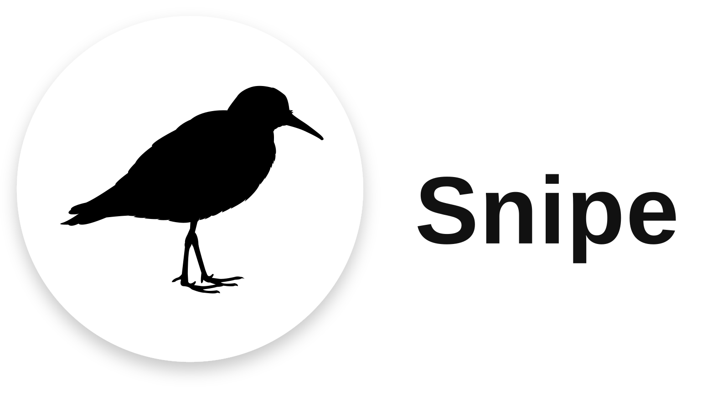
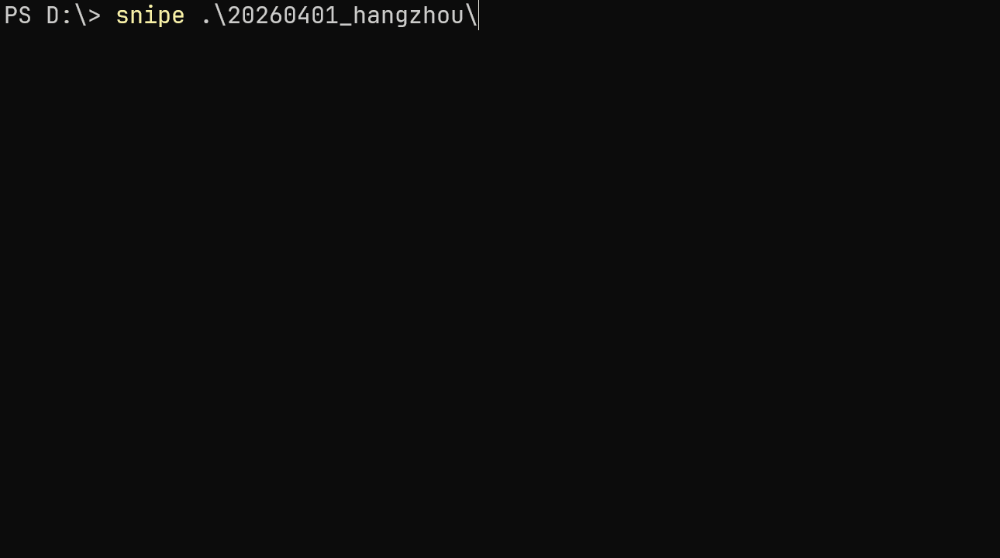
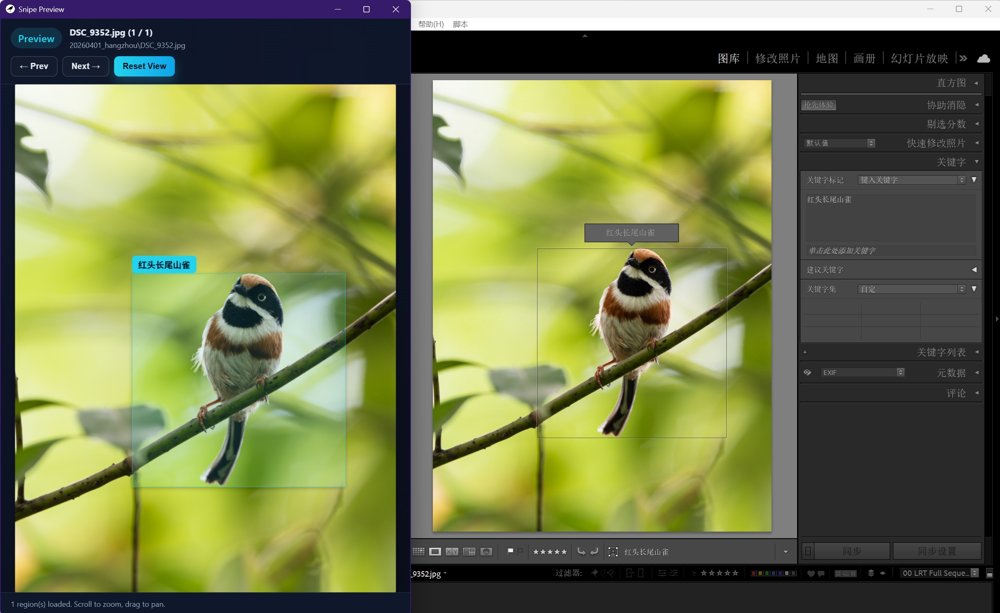

<p align="center">
	
</p>

Detect birds in JPGs or common RAW formats (NEF/CR2/ARW/CR3/DNG), tag them with accurate species labels, and write MWG region metadata.

✨ **Key Features**
- Out-of-the-box usage on CPU with a simple local install and a smaller package footprint because models are downloaded on demand instead of bundled.
- High-performance prediction on GPU when using `[gpu]` extras.
- High classification accuracy tuned for bird photography workflows.
- No extra library storage layer: Snipe writes EXIF/XMP metadata only, so it works seamlessly with Lightroom and other photo management tools that support XMP metadata.





Quick Start
-----------

```bash
pipx install "snipe-cli[cpu]"
# init will create default config and download models.
snipe init
snipe ./path/to/photos
```

Install
-------

Prerequisites:
- Python 3.12 or newer.
- ONNX models are downloaded on demand into the user model cache: Windows `%APPDATA%\.snipe\models`, Linux/macOS `~/.config/.snipe/models`.
- Labels, taxonomy, and GPS filter data remain packaged under `snipe/resources/`.

Install from PyPI with pipx:

```bash
pipx install "snipe-cli[cpu]"
```

If `pipx` is not using Python 3.12+, select the interpreter explicitly:

```bash
pipx install --python python3.12 "snipe-cli[cpu]"
```

Install from PyPI with pip:

```bash
python -m pip install "snipe-cli[cpu]"
```

For the GPU runtime build, install `snipe-cli[gpu]` instead.

Install from source:
```powershell
git clone https://github.com/woolen-sheep/snipe.git
cd snipe
uv sync --extra cpu
```

After syncing from source, activate the virtual environment or prefix runtime commands with `uv run` while working from the checkout.

For the GPU runtime build from source, install with:

```powershell
uv sync --extra gpu
```

Snipe ships as a single package. The `cpu` extra installs `onnxruntime`, while the `gpu` extra installs `onnxruntime-gpu`.

Run `snipe init` once if you want to create the default config file and pre-download the managed detector/classifier models before the first processing run.

At runtime Snipe detects which ONNX Runtime package is installed and prefers `CUDAExecutionProvider` automatically when the GPU package and CUDA runtime dependencies are available. If CUDA cannot be initialized, Snipe falls back to `CPUExecutionProvider`.

The `gpu` extra does not bundle NVIDIA system libraries by itself. You still need a compatible local CUDA Toolkit and cuDNN installation for `onnxruntime-gpu`.

For the GPU extra on Windows, make sure the system runtime dependencies required by your `onnxruntime-gpu` build are installed and visible on `PATH`. The current setup was validated with CUDA 12 and cuDNN 9.

Config File
-----------

Most workflows do not require a config file. Run `snipe init` to create the default config file and download the managed models. Snipe reads its default config from:
- Windows: `%APPDATA%\.snipe\config.yaml`
- Linux/macOS: `~/.config/.snipe/config.yaml`

Managed models are stored separately under:
- Windows: `%APPDATA%\.snipe\models`
- Linux/macOS: `~/.config/.snipe/models`

For a full example configuration, see [config.example.yaml](config.example.yaml).

You can also keep a config file anywhere and pass it explicitly:

```powershell
snipe --config .\config.example.yaml .\photos
```

Detailed Usage
--------------

Core commands:

```powershell
snipe <file-or-directory> [options]
snipe init
snipe clear <directory> [--workers N]
snipe preview <file-or-directory>
python -m snipe <file-or-directory> [options]
```

Output
------
- Adds classification labels to `XMP:Subject` and `XMP:HierarchicalSubject`.
- Writes each bird crop as an `mwg-rs:RegionList` entry with normalized rectangle coordinates.

Preview Mode
------------
- `snipe preview <path>` opens a pywebview window that shows one image at a time.
- Uses arrow keys or on-screen buttons to move between images; scroll to zoom and drag to pan.
- Reads XMP MWG Region metadata and overlays boxes and labels on top of the image.

Clear Mode
----------
- `snipe clear <directory>` removes only the XMP fields managed by Snipe from supported images under that directory.
- The clear command writes empty keyword and MWG region values through `exifmwg` so the clear behavior can be validated against real files.
- The command accepts a directory path only, supports `--workers` for parallel clears, and logs each clear normally.

Key Options
-----------
- `-o, --output-dir` copy images there before tagging; omit to write in place.
- Supports JPG plus RAW files such as `.nef`, `.cr2`, `.cr3`, `.arw`, `.orf`, `.rw2`, `.raf`, `.dng`, `.pef`, `.sr2`.
- `--conf` confidence threshold for bird detection (default 0.35).
- `--workers` number of parallel threads.
- `--detector-model` path to a local YOLO ONNX detector model; omit it to use the managed model downloaded into the user cache.
- `--detector-merge-overlap-threshold` overlap ratio used by the detector post-processing merge heuristic (default 0.7).
- `--detector-min-box-area-ratio` minimum box area as a fraction of the largest detected box; smaller boxes are dropped (default 0.05).
- `--gps-filter/--no-gps-filter` enable or disable GPS-based species filtering (default enabled).
- `--gps-filter-data` path to the JSON GPS filter data used for in-memory species filtering.
- `--region-filter` force filtering by a specific region code such as `CN` or `CN-11`; this implies location filtering automatically.
- `--language` common-name language enum; supported values are `CN` and `US` (default `CN`).
- `--classifier-model` path to the ONNX classifier.
- `--labels` labels file for classification.
- `--taxonomy` path to the merged common-name CSV with `COMMON_NAME_ZH_CN` and `COMMON_NAME_US` columns.
- `init` creates the default config if missing and downloads the managed ONNX models if they are missing or fail checksum validation.
- `--log-level` logging level; leave it unset or set it to `null`/`none` in process mode to use the cross-worker `tqdm` progress UI instead of log lines.
- `--dry-run` skip EXIF writes while running detection/classification.

Python API
----------
Snipe also exposes an importable API for single-image inference. The public entrypoint returns a typed `list[BirdDetection]` and supports both `region_code` and `language_code` parameters.

```python
from snipe import detect_birds

results = detect_birds(
	r"D:\photos\bird.jpg",
	region_code="CN",
	language_code="CN",
)

for item in results:
	print(item.bird_name, item.species_code, item.score, item.bbox.as_tuple())
```

API notes:
- `detect_birds(...)` accepts a local file path, raw image bytes, `io.BytesIO` or another binary file-like object, a `PIL.Image.Image`, a `numpy.ndarray` RGB image, or a `file://` / `http(s)://` URL.
- Each `BirdDetection` item contains `bird_name`, `species_code`, `score`, `bbox`, `image_width`, and `image_height`.
- `bbox` is a typed `BoundingBox` object with `left`, `top`, `right`, `bottom`, `width`, `height`, and `as_tuple()`.
- When `image` is a local file path or `file://` URL and `region_code` is omitted, the API can use embedded GPS metadata for species filtering just like the CLI.

Developer Notes
---------------

Project Layout
--------------
- Runtime package code lives under `snipe/`.
- Packaged runtime support assets live under `snipe/resources/` and `snipe/web/`.
- Repository-level `data/` is kept as editable source/reference input for now.
- Local ONNX model source files live under `local_models/` and are published separately through GitHub Releases.
- Developer helper scripts live under `tools/`.

Runtime Notes
-------------
- Detector and classifier ONNX models are downloaded lazily from the dedicated model release tag into the user model cache when they are missing.
- ONNX Runtime provider selection is automatic: `snipe-cli[cpu]` runs on `CPUExecutionProvider`, while `snipe-cli[gpu]` attempts `CUDAExecutionProvider` first and falls back to CPU if the CUDA stack is unavailable.
- GPS species filtering uses the packaged `snipe/resources/location_species_filter.json` artifact and preloads the filter data into memory at startup.

YOLO ONNX Export
----------------
If you need to convert local `.pt` YOLO weights into ONNX files, use the tool script with temporary export-time dependencies:

```powershell
uv run --with ultralytics --with onnx python tools/export_yolo_onnx.py
```
